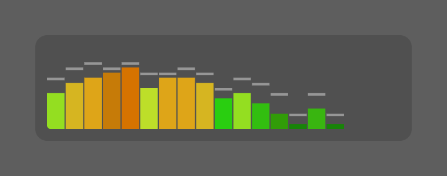

# Visualizer

A real-time audio spectrum analyzer for [Übersicht](http://tracesof.net/uebersicht),
driven by whatever is actually playing. It recreates the classic Winamp visualizer:
a quantised 16-row bar display with the original VISCOLOR ramp, gravity-fed peak
markers, and the three classic colour modes, live on your desktop.



Because it analyses real audio rather than reading track metadata, it responds to the
music itself. It also tells the difference between silence and a paused source, so it
fades away when the music stops and comes back when it starts.

```
Music.app  ┐
Spotify    ├─▶ Loopback virtual device ──▶ visualizerd ──▶ ws://127.0.0.1:41500 ──▶ widget canvas
any player ┘                               (Swift, FFT)                              (jitter buffer)
```

Any app that makes sound can feed it. The daemon taps the virtual device, not an
application, so Music.app, Spotify and anything else are all supported by adding each
as a source on that device (see [Setup](#setup)).

## A companion to the Music widget

This is built as a companion to
**[uebersicht-music](https://github.com/dionmunk/uebersicht-music)**, and the two are
designed to be run together: that widget shows you *what* is playing, this one shows
you the sound of it. They share the collection's panel treatment, and by default this
widget pins itself directly beside the Music widget, bottom-aligned with it, so the
pair reads as one unit (see [Placement](#placement)).

Neither depends on the other. The Music widget works on its own, and this one only
needs the audio daemon below, so you can run either alone. They do line up well
though: the Music widget reads now-playing from Apple Music or Spotify, and this one
visualizes whichever of them you route into the virtual device, so pointing both at
the same players gives you the track and its spectrum side by side.

## Why there is a daemon

The obvious approach, `getUserMedia` inside the widget, cannot work. Übersicht 1.6
ships no `NSMicrophoneUsageDescription` in its `Info.plist` (it declares Bluetooth,
Calendar, and HomeKit, but not the microphone), so macOS terminates the process on
first audio-device access. Separately, WKWebView on macOS 12+ only grants capture if
the host app implements the `requestMediaCapturePermissionFor` delegate, which
Übersicht does not. Both would have to be fixed by patching and re-signing the app.

A separate signed binary carries its own usage string and gets its own TCC grant, so
it sidesteps the problem entirely. The widget never touches audio; it only draws.

## Setup

### 1. Route audio into a virtual device

Create a virtual device in [Loopback](https://rogueamoeba.com/loopback/) (or
[BlackHole](https://github.com/ExistentialAudio/BlackHole), which is free) and add
your music app **as a source**. Adding the app as a source is better than changing
your system output device, because only that app's audio is captured.

**Any app works, and you can add more than one.** The daemon analyses whatever
reaches the virtual device and neither knows nor cares which app produced it, so
**Music.app and Spotify.app are both supported** simply by adding each as a source on
the same device. The same goes for any other player you use, browser audio included.
With several sources on one device you get a visualizer that responds to whichever
one is playing, with no daemon restart and no configuration change here.

This pairs with [the Music widget](https://github.com/dionmunk/uebersicht-music),
which reads now-playing from Apple Music or Spotify: add both apps as sources and
the two widgets cover the same players.

> **Important: add a monitor.** A Loopback device with no monitor swallows the audio,
> and you will stop hearing your music. In Loopback, add your real output (speakers,
> headphones, display) under **Monitors** for that device. This is a Loopback
> configuration step, not something the daemon controls.

> **BlackHole routes differently.** It has no per-app sources or monitors: you send
> an app's output to the BlackHole device, then use a **Multi-Output Device** in Audio
> MIDI Setup (BlackHole plus your real output) so you still hear it. Loopback's
> per-app sources are the easier route if you want several apps feeding one device.

### 2. Build the daemon

```sh
./lib/build.sh
```

This compiles `lib/visualizerd.swift`, links `lib/visualizerd-info.plist` into the
binary as a `__TEXT,__info_plist` section, and ad-hoc signs it with a stable
identifier so the microphone grant persists across runs.

The plist is deliberately not named `Info.plist`: codesign treats any directory
containing one as a bundle, and would sign all of `lib/` with a sealed resource
directory that goes invalid whenever anything else in there changes.

> **After a rebuild, check the microphone grant.** Rebuilding moves the binary's cdhash,
> so macOS treats it as a new program and asks again. That is expected. What is not
> obvious is the failure mode if the request is missed or dismissed: **a denied process
> is handed zero-filled buffers, not an error.** Capture starts, buffers arrive at a
> perfectly steady rate, nothing throws, nothing logs, and every band reads 0. It is
> indistinguishable from a silent device, and it survives restarting the daemon, the
> player and Loopback, because none of those are the problem.
>
> A recorded *deny* also sticks. `tccutil reset Microphone <id>` does not work here,
> since that takes a bundle identifier and this is a bare binary, and the untargeted
> `tccutil reset Microphone` would clear every app on the machine. Fix it by hand in
> **System Settings > Privacy & Security > Microphone**, switching `visualizerd` back on.
>
> To check the state directly:
>
> ```sh
> sqlite3 "$HOME/Library/Application Support/com.apple.TCC/TCC.db" \
>   "select client, auth_value from access
>    where service='kTCCServiceMicrophone' and client like '%visualizerd%';"
> ```
>
> `2` is allowed, `0` is denied. Requires Full Disk Access for the calling terminal.

### 3. Check it can see the device

```sh
./lib/visualizerd --list
```

### 4. Run it

```sh
./lib/visualizerd --device "Music"
```

`--device` names the **virtual device** from step 1, not an app. `"Music"` is just
what the device happens to be called here; if you named yours `Loopback Audio` or
`BlackHole 2ch`, pass that instead. Matching is case-insensitive, exact first and
then substring, so `--device "Loopback"` finds `Loopback Audio`. Step 3 lists the
names available.

Approve the microphone prompt the first time. To start it automatically at login:

```sh
./lib/install-agent.sh "Music"      # remove with --uninstall
```

### 5. Point the widget at it

The widget defaults to port `41500` and connects on its own. If the daemon is not
running, the panel shows `no audio daemon` and retries with backoff.

## Placement

The widget sits at the foot of **column 2**, immediately right of
[the Music widget](https://github.com/dionmunk/uebersicht-music) and bottom-aligned
with it, one column wide:

| | left | bottom | width | height |
|---|---|---|---|---|
| `music.widget` | 10 | 10 | 320 (COL) | depends on its `layout` |
| `visualizer.widget` | 340 | 10 | 320 (COL) | 90 |

`left = EDGE + 1·(COL + GAP) = 340` and `bottom = EDGE = 10`, using this collection's
shared grid tokens (`EDGE` 10, `COL` 320, `GAP` 10, `UNIT` 80), so
the two share a bottom edge whichever `layout` the Music widget is set to. On a
2560×1440 screen with Music in its `horizontal` layout the pair occupies y 1338–1430;
its `square` layout is much taller and grows upward from the same bottom edge.

Column 2's stack (weather → news → stocks) ends at y=921 on a 1440px-tall screen,
leaving plenty of clearance above. On a shorter screen, check that stocks still
clears it.

The 90px height is deliberately 10px over `UNIT`: at 16 quantised rows an 80px panel
reads as a stack of dashes rather than bars. Height and `rows` are what set how chunky
the display looks; the level mapping is independent of both.

### Two columns wide

`columns` sets how many grid columns the widget spans, and with it how many bars are
drawn:

| `columns` | width | bars (`thick`) | bar width |
|---|---|---|---|
| `1` (default) | 320 (`COL`) | 19 | 14.8px |
| `2` | 650 (`2·COL + GAP`) | 38 | 15.6px |

The bar count doubles with the width on purpose. The extra room buys **more** bars
rather than wider ones, so a two-column display keeps the bar width the original has
instead of stretching into something that no longer reads as that analyzer. It comes
from grouping the daemon's 75 bands half as coarsely: `thick` averages them in twos
rather than fours.

**`thin` is the exception and cannot double.** It is already one bar per band, so there
is nothing left to divide and a two-column widget draws the same 75 bars at twice the
width. Extra detail there has to come from the daemon, which takes a `--bands` flag,
though it caps at 128, so a true doubling to 150 is not available even by hand.

Width follows the grid symbolically, as `calc(var(--grid-col) * 2 + var(--grid-gap))`,
so the span tracks a grid the controller computes differently. `columns` only decides
the footprint while `width` is `"grid"`; an explicit px `width` wins over it, and
`columns` is then left setting nothing but the bar density.

Two notes on where a wide one lands:

- **Managed mode needs nothing extra.** The layout controller derives a widget's span
  from its measured width, so 650px is packed as two columns with no `data-layout-span`
  declared here.
- **Manual mode is your problem.** At the default `horizontalOffset: 340` a two-column
  widget covers columns 2 and 3, which is where `github-contributions` sits in the
  documented grid. Move it, or let the controller manage it.

### Working with layout-controller.widget

`layoutMode` decides whether the widget joins the desktop grid:

| Value | Behaviour |
|---|---|
| `manual` | Pins itself with the position options and sets `data-layout-manual` on its root element, the controller's documented opt-out |
| `managed` (default) | Joins the grid. The controller packs and drags it like any other widget, and the position options only decide where it sits until then |

`manual` used to be the default, because of the companion relationship: this widget
and the Music widget both belong at the foot of the screen, and the controller packed
columns only downward from the top, so being managed meant being dragged up into a
stack away from the widget it pairs with.

The controller now anchors each widget to the screen edge it belongs to, so that
reason is gone. This widget publishes `data-layout-anchor` from its `verticalPosition`
option, which means it can be packed and dragged like anything else and still sit
where it was written to sit, with no first drag needed to teach it. Anchoring needs
layout-controller 2026-08-10 or newer; older versions ignore the attribute, in which
case set `layoutMode: "manual"` to keep the old behaviour.

The widget also *reads* the grid rather than restating it. Setting `width: "grid"`
(the default) resolves to `var(--grid-col, 320px)`, and `height: "grid"` to
`var(--grid-unit, 80px)`, so the footprint follows whatever grid the controller
publishes. Every reference carries the hardcoded value as its fallback, so nothing
changes when the controller is not installed.

If the controller has already recorded a position from a drag, or from a load before
`data-layout-manual` was set, that saved entry keeps being replayed even after
switching back to `manual`. Clear it:

```sh
F="$HOME/.config/ubersicht/layout.json"
cp "$F" "$F.bak"
jq '.screens |= with_entries(.value.positions |= del(."visualizer-widget-index-coffee"))' "$F" > "$F.tmp" && mv "$F.tmp" "$F"
```

then restart Übersicht, since the controller only re-reads that file on startup.

## The classic analyzer

The renderer recreates the Winamp 2.x spectrum analyzer: a quantised bar display
with the 16-colour VISCOLOR ramp, a dotted backdrop, gravity-fed peak markers, and
the three classic colour modes.

### Provenance

**No Winamp source is used here.** Winamp's code was published in September 2024
under the Winamp Collaborative License, which is not an open-source licence: v1.0
forbade forking outright, and v1.0.1 still banned distributing modified versions in
source or binary form. Llama Group then [deleted the repository](https://www.tomshardware.com/tech-industry/winamp-owner-deletes-open-source-repository-after-a-bumpy-month-on-github)
in October 2024, after third-party code (Intel and Microsoft codecs, Shoutcast
DNAS) was found in it. Community mirrors carry the same terms, so building on it
would leave this widget undistributable.

Instead the behaviour is modelled on **[Webamp](https://github.com/captbaritone/webamp)**
(MIT), a from-scratch reimplementation of Winamp 2.9 that renders to canvas — the
same medium as this widget — plus the publicly [documented VISCOLOR.TXT format](https://winampskins.neocities.org/config).

### Palette

Three schemes, set with `colorScheme`. They are orthogonal to the `colorStyle` modes
below: every palette runs through all three styles.

| `colorScheme` | Ramp |
|---|---|
| `winamp` | The 16-colour VISCOLOR ramp: red at the top through amber to green at the bottom. Ignores the theme |
| `theme` | Follows the theme controller, built from the active scheme's four data-series colours |
| `monochrome` | No hues. One ink colour at a stepped opacity, brightest at the top of the ramp |

**`winamp`.** `VISCOLOR.TXT` is a 24-line file every classic skin ships: line 0
background, line 1 backdrop dots, lines 2–17 the sixteen spectrum colours (top of
pane down to bottom), 18–22 oscilloscope, 23 peak marker. The defaults in
`index.coffee` are the stock ramp. Paste any other skin's values into the `VISCOLOR`
block to reskin it.

Only the spectrum and the peak marker are taken from a skin. The backdrop dots and the
pane behind them are transcribed for completeness but not drawn: the dots always use
the theme's neutral (below) and the pane is this collection's own panel, or nothing at
all.

**`theme`** and **`monochrome`** both follow `theme-controller.widget`. See
[Theming](#theming) below.

### Theming

Optional, and driven by
[uebersicht-theme-controller](https://github.com/dionmunk/uebersicht-theme-controller).
Nothing here requires it: every token is read with the widget's own value as the
fallback, so the analyzer looks right on its own.

The panel, text and status message have always read the shared tokens
(`--panel-bg`, `--panel-blur`, `--text`, `--text-secondary`), so the widget's
*chrome* follows the theme under any `colorScheme`. `theme` and `monochrome` extend
that to the bars themselves.

**`theme`** builds its ramp from the four data-series roles the theme controller
publishes, `--series-primary` through `--series-quaternary`. Every colour scheme maps
those hot-to-cool in the same order (red / orange / yellow / green), which is the
same shape the VISCOLOR ramp has, so the four are read as stops and interpolated out
to all 16 steps. Switching scheme in the controller reskins the analyzer with no edit
here. Under `monochrome` the controller sets those same roles to ink at descending
opacity, so this scheme does the right thing there too.

**`monochrome`** ignores hues entirely and uses the mode's ink at a stepped opacity:
the 16 steps run from `monoRange[1]` at the top of the ramp down to `monoRange[0]` at
the bottom (default `.3` → `1`). Peak markers take the top step.

**The backdrop dots are always neutral**, in every scheme including `winamp`: ink at
`.05`, matching the `--dot-grid` token the rest of this collection uses. They are
structure rather than data, something for the bars to read against. VISCOLOR gives
them a solid blue-grey, which was legible on Winamp's opaque black pane but on a
translucent panel reads as a second colour competing with the ramp. With no theme
controller installed they fall back to white ink. Turn them off entirely with
`grid: false`.

Both resolve tokens with `getComputedStyle` on `:root` rather than through a
stylesheet, because a canvas cannot inherit custom properties the way a styled
element does. The resolved ramp is cached and invalidated from a `MutationObserver`
on `:root`, so a mode flip or scheme change repaints without a widget reload and
without costing a style recalc every frame. Theme colours arrive as whatever CSS
colour the theme file wrote, so they are normalised through a scratch canvas
(assign to `fillStyle`, read it back) rather than a hand-rolled hex parser.

Both degrade gracefully with no controller installed: `theme` falls back to the
Winamp ramp rather than inventing colours, and `monochrome` falls back to white ink.


### Background

`background` picks what sits behind the bars:

| Value | Behaviour |
|---|---|
| `panel` | This collection's translucent blurred panel |
| `none` | Nothing. The bars sit straight on the desktop, with no pane and no blur |

`none` keeps the widget's footprint and padding, so the bars do not shift position
when you switch, and the silence fade still works, since that animates the whole
panel's opacity either way. Dropping the blur is part of the point: a
`backdrop-filter` under a fully transparent background still costs a blur pass over
the panel on every frame. The one thing that loses its backing is the
`no audio daemon` message, though it keeps its text-shadow and stays readable on most
wallpapers.

### Ballistics

The classic analyzer does not ease in both directions. A bar **snaps up instantly**
to a louder reading and only its descent is rate-limited, at a fixed rate rather
than an exponential decay. Peaks hold where the bar left them, then **accelerate**
downward. That asymmetry is most of why it reads as "that" analyzer instead of a
smooth modern meter.

Because of this, the daemon's own smoothing defaults to off (`attack`/`decay` = 1.0)
and all ballistics live in the widget. A second exponential decay upstream would
blunt exactly the snap the look depends on.

**The steps are per frame, not per second.** The original works in whole pixels of a
16px pane per rendered frame, so its two falloff sliders are only meaningful against
a fixed frame rate. The widget therefore runs its ballistics on a clock of its own
(`visRefresh`, 60Hz) rather than off the repaint loop: a repaint spanning two ticks
runs both, one spanning none leaves the bars where they are. Scaling the steps by
real elapsed time instead lands the bars on the same heights on average, but lets a
row boundary be crossed at any moment in between, which under `line` (below) reads as
a shimmer rather than a stair.

The two ladders are the original's own, converted from pixels of its pane into
fractions of full scale so `rows` changes the resolution of the display without
changing how fast anything on it moves:

| Slider | 1 | 2 | 3 | 4 | 5 | |
|---|---|---|---|---|---|---|
| `analyzerFalloff` | 3 | 6 | 12 | 16 | 32 | sixteenths of a pixel per frame, flat |
| `peakFalloff` | 1.05 | 1.1 | 1.2 | 1.4 | 1.6 | velocity multiplier per frame |

A peak starts at 3/256 pixels per frame and multiplies that velocity every frame, so
it hangs for a beat and then plummets, rather than accelerating evenly under gravity.
`analyzerFalloff: 3` and `peakFalloff: 2` are a fresh Winamp's defaults, and this
widget's: a full-height bar falls to nothing in ~0.36s, its peak in ~0.87s.

Winamp's own refresh-rate slider repeatedly halves its frame rate, so 30 / 15 / 7.5
are the other authentic `visRefresh` values. Lower is chunkier.

### Colour modes

Applies to every palette; the colour names below describe `winamp`.

| `colorStyle` | Behaviour |
|---|---|
| `normal` | Ramp anchored to the pane: a pixel's colour depends on its height, so a bar shows a gradient and only tall ones reach red |
| `fire` | Ramp anchored to each bar's own top, so every bar runs the full ramp regardless of height and the display reads hot |
| `line` | Each bar is filled in a single flat colour sampled from the ramp at that bar's height, so the whole column flickers red → amber → green as it falls |

Under `line` the flicker *is* the ballistics: with the default 16 `rows` the ramp maps
one colour to one row, so the fill changes on every row the bar steps through. The
switch points are the `Math.round` half-steps, every 6.25% of pane height (3.125%,
9.375%, … 96.875%), and at the defaults a falling bar crosses all sixteen in ~0.36s,
about 45 colour changes a second.

`bandWidth: "thick"` averages the daemon's 75 bands in groups of four for the
classic wide mode's 19 bars; `"thin"` draws all 75.

### Reaching the top of the ramp

Whether all sixteen colours get *used* is a question about level, not about palette,
and the original answers it by running hot. It feeds its FFT the waveform divided by
24, so a full-scale signal arrives at roughly five times the height of the pane and
`saData >= maxHeight` clamps constantly. Saturating is not an edge case there; it is
why the reds get seen.

The daemon deliberately does the opposite, mapping dB to 0..1 with headroom so the
display is not pinned to the ceiling. Measured against real playback, that left the
brightest red unreachable: bands peaked around 0.96 of full scale, just under the
0.96875 the top row needs, so one of the sixteen entries never appeared at all. But
the level *mapping* matters far more than the level itself, and it is the mapping that
decides where the display spends its time.

**Winamp's analyzer is linear in amplitude, not dB.** Its FFT hands back
`sqrt(re² + im²)`, which is compared straight against pixel height and clamped. There
is no dB conversion anywhere in the chain. The one `log10` in
[`FFTNullsoft.ts`](https://github.com/captbaritone/webamp/blob/master/packages/webamp/js/components/FFTNullsoft.ts)
is applied to the *frequency index*, a per-bin weighting running 0.024 at DC to 1.0 at
Nyquist, so a 32dB high-frequency tilt (the daemon's `tiltDb` does the same job with
16). That is a weighting, not a log of amplitude.

A linear mapping is what makes the classic analyzer spiky: quiet content stays on the
floor and only real peaks climb. A dB mapping does the opposite, lifting everything
into the middle of the ramp. The gap is large:

| band level | linear (what we do) | raw dB reading |
|---|---|---|
| -18 dB | row 11 | row 14 |
| -24 dB | row 5 | row 12 |
| -30 dB | row 3 | row 10 |
| -36 dB | row 1 | row 8 |
| -48 dB | row 0 | row 5 |

The daemon does convert to dB, so the widget converts back, using `dbSpan` to know the
window. Measured over 20s of playback at the same ~1.5% of bars pinned at the ceiling:

| | dark | green | amber | top four | median row |
|---|---|---|---|---|---|
| linear | 26.1% | 65.4% | 6.8% | **1.8%** | 2 |
| raw dB | 2.7% | 24.9% | 58.5% | **13.9%** | 9 |

Both reach all sixteen entries; the dB reading just spends its life in the warm middle
of them, which is not what the original looks like.

If it reads too sparse, lower `dbSpan` (48 takes dark from 26% to 16%) before touching
`gain`. `gain` (1.0) is applied after the curve and hard-clipped, matching where the
original's sits: on the waveform ahead of its FFT, so on an amplitude rather than a dB
reading. Raising it moves the ceiling along with everything else and is rarely the fix.

## Options

Widget options live at the top of [`index.coffee`](index.coffee): `layoutMode`,
position and size, `colorScheme` (`winamp` / `theme` / `monochrome`) and `monoRange`,
`colorStyle` (`normal` / `fire` / `line`), `background`, `bandWidth`, `rows`,
`barGap`, `vizRadius`, `dbSpan`, `gain`, peak markers, the falloff speeds,
`visRefresh`, the fade options, and the jitter-buffer latency cap.

`vizRadius` (3) rounds the analyzer area itself, which is the canvas inside the
panel's 10px padding rather than the panel. It is a canvas clip, not CSS
`border-radius` on the element, so it behaves identically in WKWebView (where the
widget runs) and in Chrome (where the browser preview renders it). Only what reaches
an edge is affected: in practice the outer bottom corners of the end bars, plus their
top corners once a bar is loud enough to fill the pane. The geometrically concentric
value would be 0 (the panel's 10px radius less its 10px padding), so any rounding
here is a deliberate look; 3 sits just inside the 6px used for `music.widget`'s
album art.

Daemon options:

```
--list                  list input-capable devices
--selftest              push a synthetic 1 kHz tone through the analyzer
--device <name>         virtual input device to tap, not an app name; matched
                        case-insensitively, exact then substring (default: Music)
--port <n>              WebSocket port (default: 41500)
--fft <n>               FFT window, power of two (default: 2048)
--bands <n>             frequency bands (default: 75, the classic band count)
--simulate-stall <sec>  pull the tap that long after capture starts, to
                        exercise the watchdog
--floor / --ceil <dB>   normalization window (default: -72 / -12)
--tilt <dB>             high-frequency lift (default: 16)
--attack / --decay      smoothing coefficients (default: 1.0 / 1.0, i.e. off —
                        ballistics live in the widget, see above)
--verbose               log frame rates and raw dB ranges
```

## Troubleshooting

| Symptom | Check |
|---|---|
| Panel says `no audio daemon` | Is the daemon running? `lsof -nP -iTCP:41500 -sTCP:LISTEN` |
| Bars flat while music plays | `--verbose`; if `raw dB` sits near -100 the device is receiving silence, so the virtual device is not getting that app's audio. Check the app you are playing from is actually one of the device's sources: adding Music.app does nothing for Spotify, and vice versa |
| You cannot hear your music | Loopback has a per-source **"Mute when captured"** option; turn it off. Also confirm the device has a Monitor pointing at your real output (step 1) |
| Widget invisible but connected | `layout-controller.widget` is positioning it; see [Placement](#placement) |
| Suspect the DSP | `./lib/visualizerd --selftest` renders a 1 kHz tone and asserts it lands in the right band |
| Port conflict | Übersicht owns 41416 and 41417; pick another with `--port` and update the widget's `port` option |
| Panel never fades out | Only silence fades it, and silence is judged from the frame contents. Run `--verbose`: if the source is genuinely stopped but `raw dB` is not at the floor, the Loopback device is picking up something else |
| An option seems to have no effect on styling | Don't add Stylus `if` branches to the `style` block. `if #{option} == value` compares two bare Stylus identifiers and silently takes the else branch every time. Resolve the branch in CoffeeScript and interpolate the finished declaration, as `vertCss` / `panelBgCss` do |
| A declaration in `style` is silently missing | Check the indentation of any multi-line interpolated value. Stylus reads indentation as structure, so an under-indented continuation line dedents out of its rule and takes every property after it along; an over-indented one turns the line above into a selector. Both bugs were live here (no backdrop blur, and dead `center` position options). Use `INDENT_ROOT` / `INDENT_RULE`, and to see what Stylus actually produced, render the block with the copy of Stylus inside Übersicht: `Übersicht.app/Contents/Resources/node_modules/stylus` |
